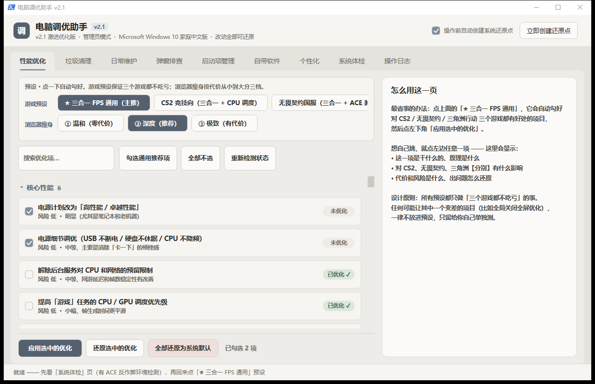
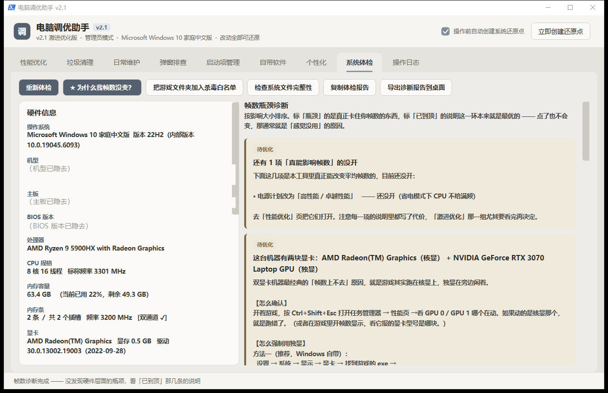
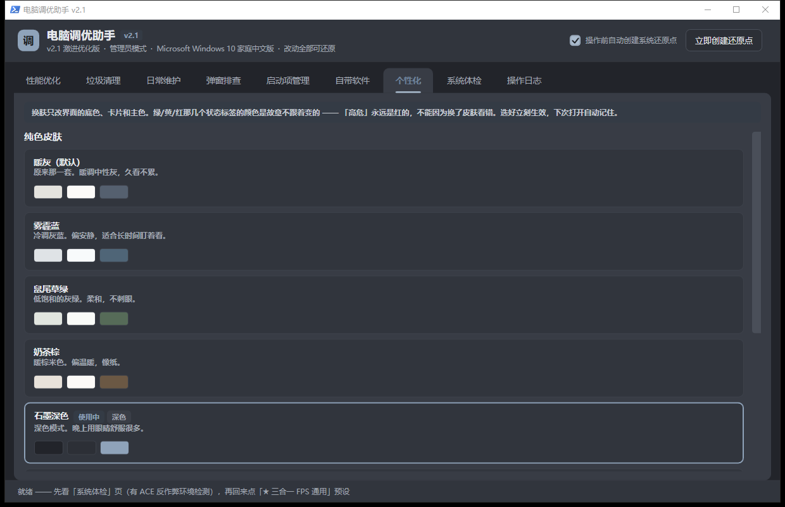

# 电脑调优助手

**给「电脑用了几年感觉变慢了、想调一调但不知道从哪下手」的人用的 Windows 调优工具。**

不用安装、不联网、不常驻后台。双击一个 bat 就能跑 —— 用的是 Windows 自带的 PowerShell，全部代码都在这个仓库里，可以自己看完再运行。



---

## 它和别的「优化大师」不一样在哪

这类工具满大街都是，大多有两个毛病：**不告诉你它改了什么**，以及**改完还不回去**。这个工具是冲着这两点做的。

**1. 每一项都写清楚「是什么、有什么用、代价是什么」**

不是一句「加速系统」就让你点。点开任意一项，左边会显示它的原理、对 CS2 / 无畏契约 / 三角洲行动**分别**有什么影响、风险等级、以及出问题怎么还原。说明是写给不懂电脑的人看的，不是抄的注册表文档。

**2. 还原用的是「你这台机器的原值」，不是网上抄来的默认值**

改任何一项之前，先把原始值存进 `Backup/original-values.json`。点「还原」时读的是这份备份 —— 所以还原是真的回到你原来的样子，而不是回到「某个网友认为的默认值」。

这件事很重要：很多注册表项的「默认值」在不同 Windows 版本、不同 OEM 预装机上是不一样的，照着网上的数值写回去，等于又改了一次。

**3. 诚实标注效果**

标「明显」的是真能感觉到；标「小幅」的就是小幅；标「因机而异」的意思是可能没用，改完自己测。有一项（Prefetch 清理）直接标了「**不推荐清**」，因为它是被优化软件误传成垃圾的有用数据。

---

## 特色功能

### 帧数瓶颈诊断 —— 回答「为什么我调了一堆，帧数没变」



这个功能的由来是一句真实反馈：「调了几项，游戏帧数一点没变。」

**这句话是对的。** 几十个开关里，真能改变平均帧数的只有五六条，其余改的是延迟、卡顿和后台占用 —— 你盯着帧数计看，当然觉得没用。

所以做了这个诊断页。它不给建议，只摆事实，逐条报告每个影响帧数的环节现在是什么状态，结论通常是这三种之一：

- **瓶颈在硬件 / BIOS 上，软件碰不到** —— 单通道内存、XMP 没开、独显没启用、温度墙降频。这几条是最常见的真凶，改注册表一辈子也修不好
- **那些真正影响帧数的项，你机器上本来就已经是最优的** —— 点了当然不会变
- **你开的那些项本来就不改帧数** —— 它们改的是手感

### 激进优化 —— 代价写明白，用不用你决定

一组「拿安全性、稳定性、功耗换性能」的选项，**默认全不勾，也不进任何预设**。每一条都写清楚代价：

| 项目 | 效果 | 代价 |
|---|---|---|
| 关闭 Spectre / Meltdown 缓解 | 老 CPU 上 5%~30%，这组里最大的一条 | 理论上的侧信道攻击风险 |
| 关闭 Defender 实时保护 | 加载 / 读图明显变快 | 机器等于裸奔 |
| 关闭 Defender 云查杀 | 卡顿改善明显 | 只损失新病毒检出率，本地防护还在 |
| 关闭 CPU 电源限流 | 笔记本上效果明显 | 功耗温度上升 |
| 关闭核心停放 + 禁止空闲 | 降低唤醒延迟 | 散热差的机器反而更慢 |
| 显卡 MSI 中断模式 | 帧生成更平滑 | 极少数老硬件不稳 |

### 自带软件清理 —— 重点是「拦住不该删的」

列出系统预装的 UWP 应用，每个都写清楚是干什么的，分三档：**可以删 / 看情况 / 必须留**。

网上那些「一键卸载所有自带应用」的脚本最容易翻车的地方，是把应用商店、安全中心界面、运行库、视频解码器一起删了 —— 删完装不回来。

所以这里有一道**硬黑名单**：命中的项在界面上直接勾不上，就算绕过界面调用，卸载函数还有一道兜底。卸载只针对当前用户、不动系统镜像，任何一个删错了都能从 Microsoft Store 装回来。

### 换肤



六套内置纯色皮肤，也可以用自己的图片当背景。

**换肤只改中性色和主色** —— 绿 / 黄 / 红那几个状态标签的颜色是故意不跟着变的，「高危」永远是红的，不能因为换了皮肤看错。深色皮肤下语义色会成对调整（前景提亮、背景压暗），所有文字对比度实测 ≥ 4.5:1（WCAG AA）。

### 其他页面

- **垃圾清理** —— 22 类，先扫描看能清多少再决定清哪些。路径全部硬编码 + 安全校验，只删缓存和临时文件
- **弹窗排查** —— 治「黑框一闪而过」。会 PE 头解析判断是不是控制台程序、扫描计划任务 / 启动目录 / 注册表 Run 项，还能挂 WMI 实时监听抓现行
- **启动项管理** —— 附带「这个能不能关」的建议
- **日常维护** —— 磁盘健康、大文件查找、刷新率检查、每周自动清理

---

## 给 FPS 玩家的部分

针对 **CS2 / 无畏契约 / 三角洲行动** 做了适配，有 5 个游戏预设。

**硬约束：任何预设都只做「三个游戏都不吃亏」的事。** 任何可能让其中一个变差的项（比如全局关闭全屏优化），一律不放进预设，只留给你自己单独测。

### ACE 反作弊的虚拟化要求

无畏契约国服和三角洲行动都用腾讯 ACE，要求 **BIOS 里的 VT-x/VT-d 开着，同时 Windows 的 HVCI / VBS / Hyper-V 关着**。

这一点和 CS2 不冲突 —— CS2 关掉 VBS 反而能涨约 25% 帧数。工具的「系统体检」页会检测当前虚拟化环境是否符合 ACE 要求。

> 注意：**国际服 Valorant 的 Vanguard 要求 HVCI 开着**，和国服要求相反。工具里标注了这个差异。

---

## 怎么用

1. 下载 [Releases](../../releases) 里的 zip，或者直接 `git clone` 这个仓库
2. 解压到一个固定位置（别放「下载」文件夹、桌面或 U 盘）
3. 双击 **`一键启动.bat`**，弹出「用户账户控制」时点「是」

> **为什么要管理员权限**：改电源计划、系统服务、注册表 HKLM 分支都必须是管理员。不给权限的话什么都做不了。

> **出问题了**：双击 `诊断启动.bat`。正常启动器会把控制台藏起来，出错信息跟着一起没了；诊断版不藏窗口、跑完不关，报错会留在屏幕上。

### 建议的使用顺序

先看「系统体检」页 → 再「垃圾清理」→ 然后「启动项管理」→ 最后才动「性能优化」。

体检会按性价比从高到低排序。很多时候你会发现，最该做的事根本不是改注册表，而是「显卡驱动两年没更新了」或者「该清灰换硅脂了」。**软件优化的天花板就那么高，体检页会诚实地告诉你天花板在哪。**

---

## 安全设计

- **改任何东西之前先备份原值**，「还原」是真的能还原
- 可选：动手前**自动创建系统还原点**
- 清理只删缓存和临时文件，**路径全部硬编码 + 安全校验**（拒绝盘符根、拒绝没有明确一级目录名的路径）
- 自带软件卸载有**硬黑名单**，只卸当前用户、不动系统镜像
- 激进选项**默认全不勾、不进预设**，每条写明代价
- 不联网、不上传任何数据、不常驻后台，关掉窗口就等于退出

---

## 技术说明

| | |
|---|---|
| 语言 | PowerShell 5.1（Windows 自带，不用装任何东西） |
| 界面 | WPF，通过 `XamlReader::Load` 运行时构建 |
| 依赖 | 无 |
| 支持 | Windows 10 / 11 |

### 文件结构

```
PCTuner/
├── 一键启动.bat          ← 双击这个
├── 诊断启动.bat          出问题时用，能看见报错
├── PCTuner.ps1           主程序（界面 + 各页面逻辑）
├── 使用说明.md
└── Modules/
    ├── Engine.ps1        备份/还原引擎（最核心的安全机制）
    ├── Tweaks.ps1        所有优化项的定义和详细说明
    ├── Games.ps1         三个 FPS 游戏的适配层 + 预设
    ├── Cleaner.ps1       垃圾清理规则
    ├── Maintain.ps1      日常维护
    ├── Inspect.ps1       弹窗排查 / 可疑驻留项检测
    ├── SysInfo.ps1       硬件检测、体检、帧数瓶颈诊断
    ├── Startup.ps1       启动项管理
    ├── Appx.ps1          自带应用清单 + 硬黑名单
    └── Theme.ps1         换肤
```

### 开发

```powershell
# 自检：把所有页面构建一遍，报告各页条目数
powershell.exe -NoProfile -ExecutionPolicy Bypass -File PCTuner.ps1 -SelfTest
```

> 注意：自检**不会**调用 `ShowDialog`，也不会真正切换页签。改了界面相关的东西，**自检通过不代表能用** —— 必须真的启动起来看一眼。这个坑踩过两次。

代码里的注释写了不少「为什么这么写」和踩过的坑，改之前建议先读。

---

## 编码约定

改代码时注意（不遵守会出现乱码或运行失败）：

- `.ps1` 文件：**UTF-8 with BOM**。PowerShell 5.1 读无 BOM 的 UTF-8 会把中文当 ANSI 解析
- `.bat` 文件：**GBK + CRLF**

---

## 许可

MIT
