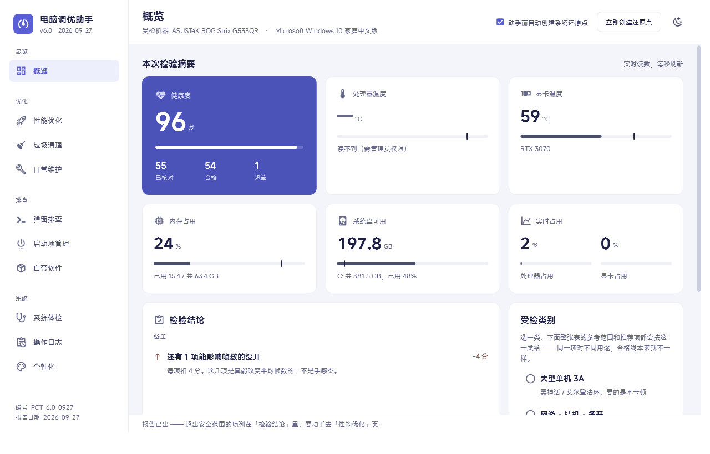
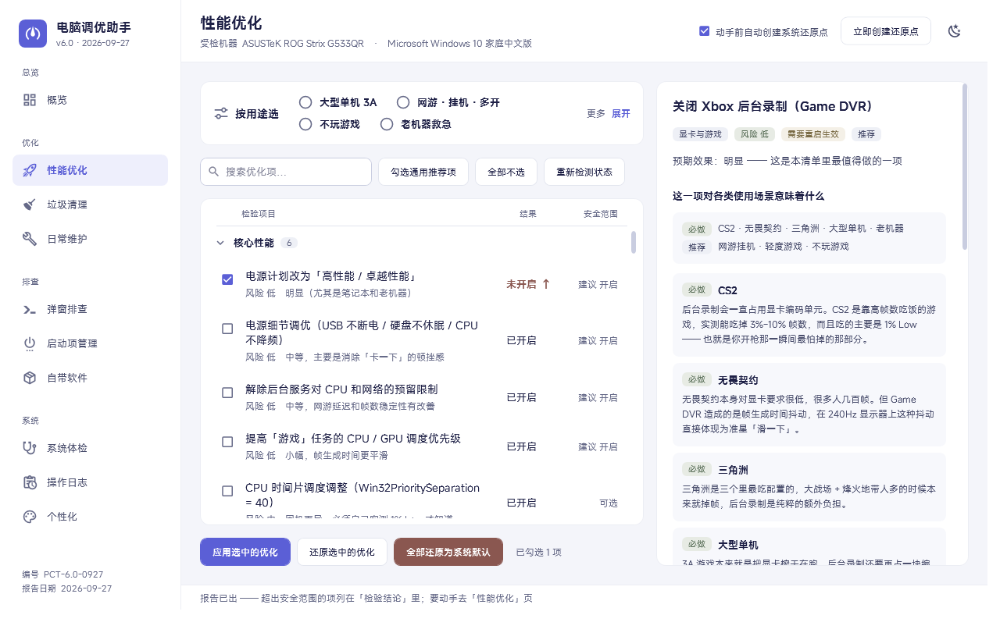
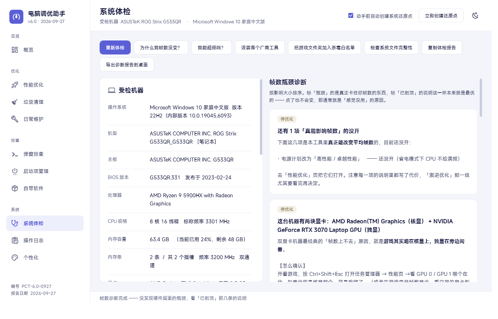
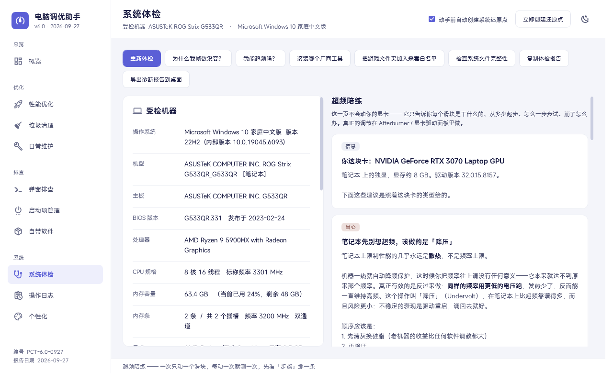
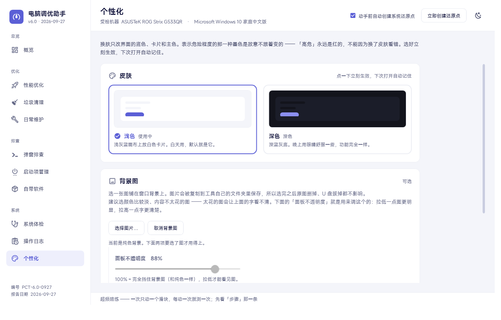

# 电脑调优助手

**给「电脑用了几年感觉变慢了、想调一调但不知道从哪下手」的人用的 Windows 调优工具。**

不用安装、不联网、不常驻后台。双击一个 bat 就能跑 —— 用的是 Windows 自带的 PowerShell，全部代码都在这个仓库里，可以自己看完再运行。



---

## 和别的「优化大师」不一样在哪

这类工具满大街都是，大多有两个毛病：**不告诉你它改了什么**，以及**改完还不回去**。

**1. 每一项都写清楚「是什么、有什么用、代价是什么」**

不是一句「加速系统」就让你点。点开任意一项，左边显示它的原理、风险等级、出问题怎么还原，以及对**你这类用户**有什么影响。

**2. 同一项对不同的人，结论经常是相反的**



上图是「关闭 SysMain」的真实结论：网游玩家「推荐」、老机器用户「慎用」（机械盘靠它预读，关了开程序更慢）、CS2 玩家「中性」。

全部 65 个优化项 × 8 种使用场景的结论都写全了，没有一条是靠模板凑的。八种场景是：竞技射击 · 大型单机 3A · 网游挂机 · 轻度游戏 / 模拟器 · 办公上网 · 老机器救急。

**3. 还原用的是「你这台机器的原值」，不是网上抄来的默认值**

改任何一项之前，先把原始值存进 `Backup/original-values.json`。很多注册表项的「默认值」在不同 Windows 版本、不同 OEM 预装机上是不一样的，照着网上的数值写回去等于又改了一次。

**4. 诚实标注效果**

标「明显」的是真能感觉到；标「因机而异」的意思是可能没用。有一项（Prefetch 清理）直接标了「**不推荐清**」，因为它是被优化软件误传成垃圾的有用数据。

---

## 主要功能

**概览** —— 实时硬件状态：CPU / 显卡温度与占用、内存、系统盘。数据来自 LibreHardwareMonitorLib，**读不到的一律显示「—」，绝不编数字**。

**帧数瓶颈诊断** —— 回答「为什么我调了一堆，帧数没变」。



几十个开关里真能改变平均帧数的只有五六条，其余改的是延迟、卡顿和后台占用。这一页不给建议，只摆事实，逐条报告每个影响帧数的环节现在是什么状态 —— 很多时候真凶是单通道内存、XMP 没开、温度墙降频这类改注册表一辈子也修不好的事。

**激进优化** —— 一组拿安全性、稳定性、功耗换性能的选项，**默认全不勾，也不进任何预设**：

| 项目 | 效果 | 代价 |
|---|---|---|
| 关闭 Spectre / Meltdown 缓解 | 老 CPU 上 5%~30%，这组里最大的一条 | 理论上的侧信道攻击风险 |
| 关闭 Defender 实时保护 | 加载 / 读图明显变快 | 机器等于裸奔 |
| 关闭 CPU 电源限流 | 笔记本上效果明显 | 功耗温度上升 |
| 关闭核心停放 + 禁止空闲 | 降低唤醒延迟 | 散热差的机器反而更慢 |

**超频陪练** —— 让没经验的人也能自己动手，而且知道自己在动什么。



**这一页一个显卡参数都不调。** 它认出你的卡，然后把行家脑子里那套流程写成大白话：每个滑块是干什么的、从多少起步、怎么一步步试、崩了怎么办。真正的调节在 MSI Afterburner / 显卡驱动面板里做。

为什么不做成「一键超频」：每块芯片的体质不一样（业内叫「硅片彩票」），网上抄来的数值在你这块卡上可能第一分钟就花屏；而且超频必须边调边测，测的是**你自己玩的那个游戏**，没人能替你按下那个「稳不稳」的判断。工具里内置一个能改显卡频率的功能，等于给自己埋一个「按了之后黑屏」的雷 —— 这个工具的底线是可还原，而显存超过头造成的画面错乱是软件还原不回来的。

页面会按卡的类型给不同的话：核显直说「没有超频这回事，别浪费时间」；笔记本先讲**降压**而不是超频（笔记本的瓶颈永远是散热，频率往上调没意义）；台式机才展开功耗墙、温度墙和风扇曲线。

里面有一条新手必踩的坑写得最细：现在的显存（GDDR6/6X）自带纠错，频率推过头**不会崩溃，而是默默重传出错的数据** —— 画面一切正常，帧数反而下降。所以显存必须按帧数判断，不能按「崩没崩」判断。很多人「超了 +1500 也不崩」，其实早就在倒扣性能。

**该装哪个厂商工具** —— 认出你的机器是哪家的，告诉你该装什么、该关什么。

华硕笔记本会建议把臃肿的 Armoury Crate 换成开源的 [G-Helper](https://github.com/seerge/g-helper)（并说清它依赖华硕底层驱动，卸奥创时要留下驱动）；联想、微星、惠普、戴尔各有各的说法；台式机直接告诉你那些「管家」软件基本只管灯效，可以不装。

这里也说清了分工：这个工具动的是 Windows 这一层（注册表、服务、电源计划、启动项），风扇转速、功耗墙、充电上限在硬件那一层，得靠厂商自己的工具。笔记本上只做一边，效果会打对折。

**自带软件清理** —— 列出预装 UWP 应用，分「可以删 / 看情况 / 必须留」三档。网上那些「一键卸载所有自带应用」的脚本最容易翻车的地方，是把应用商店、安全中心、运行库一起删了。所以这里有一道**硬黑名单**：命中的项界面上直接勾不上，卸载函数还有一道兜底。只卸当前用户、不动系统镜像。

**换肤** —— 七套内置皮肤（默认是深色的「仪表灰」），也可以用自己的图片当背景。



**换肤只改中性色和主色** —— 绿 / 黄 / 红那几个状态标签是故意不跟着变的，「高危」永远是红的。

所有文字对比度 ≥ 4.5:1（WCAG AA）。这句话有验证脚本：`dev\对比度自检.ps1` 会把 7 套皮肤 × 3 种文字色 × 5 种背景色全量算一遍，改配色之后跑一下就知道有没有破。（它抓出过 12 处不达标 —— 单看谁都觉得「还行吧」，量出来才知道不行。）

**其他页** —— 垃圾清理（22 类，先扫描再决定）· 弹窗排查（治「黑框一闪而过」，能 PE 头解析判断控制台程序、挂 WMI 实时抓现行）· 启动项管理 · 日常维护（磁盘健康、大文件查找、刷新率检查）· 系统体检。

---

## 怎么用

1. 下载 [Releases](../../releases) 里的 zip，或者 `git clone` 这个仓库
2. 解压到一个固定位置（别放「下载」文件夹、桌面或 U 盘）
3. 双击 **`电脑调优助手.exe`**，弹出「用户账户控制」时点「是」

> **为什么要管理员权限**：改电源计划、系统服务、注册表 HKLM 分支都必须是管理员；读 CPU 温度也需要。不给权限的话什么都做不了。

> **出问题了**：双击 `诊断启动.bat`（需要时右键「以管理员身份运行」）。正常启动会把控制台藏起来，出错信息跟着一起没了；诊断版不藏窗口、跑完不关。杀毒软件误报拦下 exe 时也用它，效果一样。

**建议顺序**：先看「系统体检」→ 再「垃圾清理」→ 然后「启动项管理」→ 最后才动「性能优化」。体检按性价比排序，很多时候你会发现最该做的事根本不是改注册表，而是「显卡驱动两年没更新了」。

---

## 安全设计

- **改任何东西之前先备份原值**，「还原」是真的能还原
- 可选：动手前**自动创建系统还原点**
- 清理只删缓存和临时文件，**路径全部硬编码 + 安全校验**
- 自带软件卸载有**硬黑名单**，只卸当前用户
- 激进选项**默认全不勾、不进预设**，每条写明代价
- 不联网、不上传任何数据、不常驻后台

---

## 技术说明

| | |
|---|---|
| 语言 | PowerShell 5.1（Windows 自带） |
| 界面 | WPF，通过 `XamlReader::Load` 运行时构建 |
| 控件 | [HandyControl](https://github.com/HandyOrg/HandyControl)（MIT） |
| 传感器 | [LibreHardwareMonitorLib](https://github.com/LibreHardwareMonitor/LibreHardwareMonitor)（MPL-2.0）+ HidSharp（Apache-2.0） |
| 支持 | Windows 10 / 11 |

第三方组件的协议说明见 `Lib\第三方组件说明.txt`。

**关于那个 exe**：它只有 12 KB，干三件事 —— 要管理员权限、清掉文件的「网络来源」锁定、把 `PCTuner.ps1` 拉起来。源码是 `Launcher\Launcher.cs`，用 Windows 自带的 `csc.exe` 编译（`Launcheruild.ps1`，不用装任何东西），谁都能自己重编一份对比。

没有用 PS2EXE 那类工具 —— 它们把脚本加密塞进 exe 再运行时解出来，这个行为特征和恶意软件一样，杀毒软件经常直接报毒。

```
PCTuner/
├── 电脑调优助手.exe      ← 双击这个
├── 诊断启动.bat          出问题时用，能看见报错；杀软拦了 exe 也用它
├── PCTuner.ps1           主程序（界面 + 各页面逻辑）
├── Launcher/             那个 exe 的 C# 源码 + 编译脚本 + 图标生成脚本
├── dev/                  自检脚本（对比度、漏网色号），改配色之后跑
├── Lib/                  第三方 DLL + 各自的协议文件
└── Modules/
    ├── Engine.ps1        备份/还原引擎（最核心的安全机制）
    ├── Tweaks.ps1        所有优化项的定义和详细说明
    ├── Games.ps1         使用场景适配层 + 预设
    ├── Dash.ps1          实时硬件读数
    ├── Cleaner.ps1       垃圾清理规则
    ├── Maintain.ps1      日常维护
    ├── Inspect.ps1       弹窗排查
    ├── SysInfo.ps1       硬件检测、体检、帧数瓶颈诊断
    ├── Startup.ps1       启动项管理
    ├── Appx.ps1          自带应用清单 + 硬黑名单
    ├── Overclock.ps1     超频陪练 + 厂商软件识别（只读，不改任何设置）
    └── Theme.ps1         换肤
```

### 改代码前必读

```powershell
# 自检：把所有页面构建一遍，报告各页条目数
powershell.exe -NoProfile -ExecutionPolicy Bypass -File PCTuner.ps1 -SelfTest
```

- 自检**不会**调用 `ShowDialog`，也不会真正切换页签。改了界面相关的东西，**自检通过不代表能用** —— 必须真的启动起来看一眼。这个坑踩过两次。
- `.ps1` 文件必须是 **UTF-8 with BOM**（PowerShell 5.1 读无 BOM 的 UTF-8 会把中文当 ANSI，报出来的错是「Unexpected token '淇℃伅'」这种完全看不懂的东西）。自检的第一项就是查这个，会指名道姓说哪个文件缺。`.bat` 必须是 **GBK + CRLF**。
- 改了配色之后跑 `dev\对比度自检.ps1` 和 `dev\漏网色号自检.py`：前者查 WCAG AA，后者查有没有色号漏出换肤映射（漏了的话深色皮肤下会出现「浅字压浅底」）。
- 代码里的注释写了不少「为什么这么写」和踩过的坑，改之前建议先读。

---

## 许可

MIT
